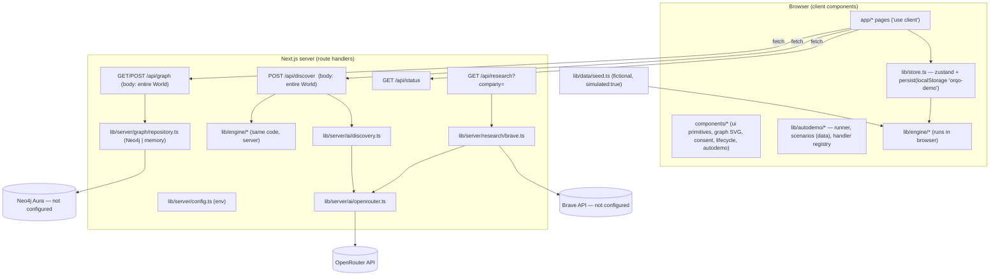
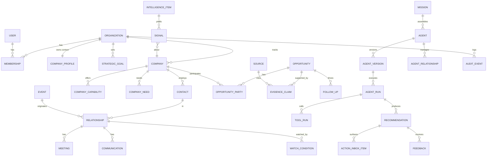
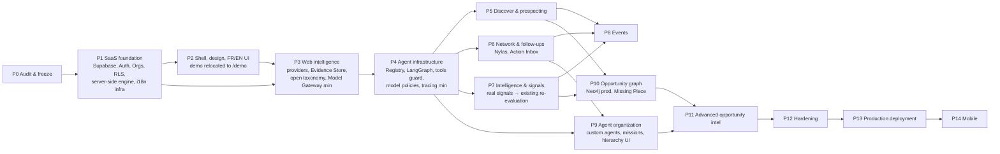

# ORQO V2 — Phase 0 Repository Audit & Architecture Freeze

| | |
| --- | --- |
| **Audit date** | 2026-09-30 |
| **Repository state audited** | `main` @ `1be66d6` (working tree clean before and after audit) |
| **Source of truth** | `ORQO_V2_MASTER_PRODUCT_TECHNICAL_SPECIFICATION.md` |
| **Mission** | `ORQO_V2_PHASE_0_MIGRATION_PROMPT.md` (audit only) |
| **Code changed during audit** | **None.** Only this report was added. |
| **Runtime behavior changed** | **None.** |

> Evidence conventions: `path:line` references point to the audited commit. "Verified" means observed at runtime during this audit. "Code-read" means established by reading the implementation, not by running it. README claims were not used to upgrade any status.

---

## 1. Executive Summary

**What ORQO is today:** a single-user, browser-local, deterministic **demo application** built with Next.js 16 / React 19 / TypeScript / Bun. Its **opportunity-reasoning engine is well built**: pure, typed, isomorphic and tested. It runs over a fictional seeded network of 5 companies and 5 people. There is no authentication, no database, no multi-tenancy, no localization and no user-driven data entry. All state lives in one `localStorage` key (`orqo-demo`).

**What is real vs mocked:**

| Real and verified in Phase 0 | Implemented but not verifiable (no credentials) | Demo / simulated only |
| --- | --- | --- |
| Deterministic engine: bilateral reasoning, 3 opportunity patterns, 9-check critic, confidence, consent → Business Match, meeting brief, re-evaluation from watch conditions, multi-company (A+B+C) composition | Neo4j graph mirror (HTTPS Query API) | All companies, people, sources and the "+6 months" signal (`simulated: true`) |
| **OpenRouter** live discovery: a real call returned HTTP 200 in ~27 s, zod-validated, then judged by the deterministic critic | Brave Search + OpenRouter extraction (`/api/research`), not wired into any UI | Demo clock / fast-forward, "Schedule meeting" (records a lifecycle stage only), the viewer switch (impersonation), Auto Demo |
| Fallbacks: live AI off → 503 → client falls back; Neo4j absent → in-memory repository | | In-memory graph repository (write-only, per process) |

**Baseline:** install ✅, typecheck ✅, lint ✅ (0 warnings), unit tests ✅ (9/9), production build ✅, E2E manual demo ✅, E2E Auto Demo ✅ (3 scenarios plus replay/pause/exit/restart/refresh), all with zero console errors.

**Migration verdict:** the **domain engine is the asset to preserve**. The application layer (client-authoritative `World` blob, `localStorage` persistence, unauthenticated API routes, demo-coupled pages, dark theme, English-only prose generated inside the domain layer) must be progressively replaced. Because the engine is a set of pure functions over a `World` value (`src/lib/engine/*`), Phase 1 can add Postgres persistence **without rewriting the reasoning**: load an org-scoped slice from the DB, run the same functions server-side, and persist the resulting diff.

**Critical conflict to resolve before Phase 1 (see §18, Q1):** the original ORQO concept (§19 of the Master Spec) has **two different companies' agents reason bilaterally and give mutual consent**. The V2 tenant model (§31) states that *no data from Organization A may appear in Organization B*. Cross-organization bilateral consent therefore needs an explicit, designed sharing construct. It cannot be migrated as-is.

**Recommended phase order:** keep the Master Spec's sequence (Phase 0 → 14). There are three within-phase adjustments driven by the code (details in §16):

1. Phase 1 must also move engine execution server-side and auth-gate the three cost-bearing API routes.
2. Phase 3 must replace the **closed 26-tag demo taxonomy**, which blocks the analysis of real companies, and introduce a minimal Model Gateway.
3. The browser-local demo should be preserved as an isolated sandbox rather than migrated into production tables.

---

## 2. Current Repository Architecture

### 2.1 Stack and tooling (verified)

| Area | Finding | Evidence |
| --- | --- | --- |
| Package manager / runtime | **Bun 1.4.2** (`packageManager`), Next.js runs on the Bun runtime (`bun --bun next …`) | `package.json` |
| Framework | **Next.js 16.3.7** App Router, Turbopack; React 19.2.8 | `package.json`, build output |
| Language | TypeScript 5, `strict: true`, path alias `@/* → src/*` | `tsconfig.json` |
| Styling | Tailwind CSS v4 via `@tailwindcss/postcss`; custom **dark** theme tokens in `@theme inline` | `src/app/globals.css:3-20` |
| Animation | `motion` 13 | `package.json` |
| State | `zustand` 5 with `persist` → `localStorage` | `src/lib/store.ts:42-100` |
| Validation | `zod` 4, used for LLM structured output only (not at API request boundaries) | `src/lib/server/ai/*.ts` |
| Fonts | `next/font/google` (Geist, Geist Mono), fetched at build time | `src/app/layout.tsx:2-7` |
| Unit tests | `bun test` (1 file, 9 tests) | `src/lib/engine/engine.test.ts` |
| E2E | Playwright scripts run as plain Bun scripts (no test runner), which assert text and fail on console errors | `scripts/e2e-demo.ts`, `scripts/e2e-autodemo.ts` |
| Lint | ESLint 9 flat config, `eslint-config-next` core-web-vitals + typescript | `eslint.config.mjs` |
| CI | **None** (no `.github/`) | filesystem |
| Deployment config | **None** (no `vercel.json`, Dockerfile, etc.) | filesystem |
| Localization | **None**; `<html lang="en">`, `en-US` date formatting hard-coded in UI *and* engine | `layout.tsx:16`, `ui.tsx:297`, `context.ts:121`, `reevaluation.ts:114` |
| Auth | **None** | — |
| Database | **None** | — |
| Agent docs | `AGENTS.md` warns that this Next.js version has breaking changes and that `next dev` rewrites the file | `AGENTS.md` |

### 2.2 Size

70 tracked files; about 8,000 lines of TS/TSX in `src/` + `scripts/`. There are no generated or dead directories in git. `.next/`, `.screenshots/`, `tsconfig.tsbuildinfo` and `next-env.d.ts` are all git-ignored.

### 2.3 Layered architecture (as implemented)



### 2.4 Module inventory

| Module | Role | Notes |
| --- | --- | --- |
| `lib/domain/types.ts` (410 lines) | Graph-first domain model: `Person, Company, Capability, Need, Objective, Constraint, Relationship, Encounter, Evaluation, WatchCondition, Opportunity, OpportunityEvidence, Contribution, ConfidenceAssessment, CriticReport, Consent, MeetingBrief, Signal, SignalEffect, Outcome, AgentActivity, NetworkProposal, World` | High quality; `Visibility` (5 levels) and `Epistemic` (fact/inference/assumption) are directly aligned with V2 §20 |
| `lib/domain/taxonomy.ts` | **Closed** set of 26 capability/need tags (`TAGS as const`) | Demo-specific vocabulary (edge AI, EU distribution, robotics…). A blocker for real companies. |
| `lib/data/seed.ts` (426 lines) | Fictional companies (EdgeVision, EuroCompute, SecureChannel, Kestrel Robotics, Atlas Freight), 5 people, 15 sources, relationships, the `futureSignal`, `DEMO_NOW`/`DEMO_FUTURE` | All sources `simulated: true` except `s-orqo-inference` |
| `lib/engine/world.ts` | Builds the initial `World`; pre-evaluated relationships are run **through the real pipeline** at historical timestamps | Good: dormant states are engine output, not hand-written |
| `lib/engine/context.ts` | Need↔capability matching, disclosure rules, evidence construction, signal recency, text helpers | Mixes domain rules with English prose helpers (`listOf`, `lowerFirst`, `regionAdjective`) |
| `lib/engine/patterns.ts` (312 lines) | 3 structure patterns: `oem-appliance`, `channel-distribution`, `customer`, in priority order with need "claiming" | Generic over the graph, but tag sets and prose are demo-specific (`"Jetson-class"`, `"security-led buyers"`, `"video analytics"`) |
| `lib/engine/critic.ts` | 9 checks (evidence, marketing, specificity, bilateral, structure, timing, constraints, assumptions, next-step) → pass/weak/reject; qualitative confidence; emits **watch conditions** | Core IP; deterministic |
| `lib/engine/pipeline.ts` | `discover` → `evaluateRelationship` (pure, returns stage reports + override seam for LLM drafts) → `commitEvaluation` (writes to world copy) | Clean seam: `override?: { tests, drafts }` |
| `lib/engine/orchestration.ts` | Private consent, `stageFor` (per-viewer view), Business Match, `buildBrief`, lifecycle `advance`/outcomes | Consent privacy is a *view* rule; it is not enforced by identity |
| `lib/engine/reevaluation.ts` | `applySignal`, `scanRelationships` (watch conditions + opportunity dependencies), `reevaluate`, deltas (what changed / why now / why not before) | Core IP |
| `lib/engine/network.ts` | Multi-company discovery: urgent gaps → scan participants' networks → compose N-way draft → critic → `NetworkProposal` → `createFromProposal` | Core IP; `DISTRIBUTION` tag list duplicated from `patterns.ts` |
| `lib/engine/research.ts` | `understandCompany` (summarizes local graph) + **`ResearchProvider` interface, which has no implementation** | Dead seam |
| `lib/graph/elements.ts` | One graph projection (`toGraph`) shared by UI and Neo4j | Reusable as the V2 graph-projection contract |
| `lib/server/config.ts` | Env reader; `publicStatus()` exposes booleans + model name only | Good secret boundary |
| `lib/server/ai/openrouter.ts` | `structuredCompletion` using `fetch`, JSON-schema response format, zod parse, 45 s timeout | No retry, no caching, no telemetry |
| `lib/server/ai/discovery.ts` | LLM discovery: schema constrains the model to cite existing capability/need IDs; evidence rebuilt server-side; the same critic judges | Good anti-hallucination design |
| `lib/server/graph/repository.ts` | `GraphRepository` interface; `MemoryGraphRepository`; `Neo4jGraphRepository` (MERGE over HTTPS Query API, closed label map) | Write-only mirror; global id namespace |
| `lib/server/research/brave.ts` | Brave search → OpenRouter extraction → `Company` with cited `Source`s; uncited items dropped | Provider, extraction and domain mapping are mixed in one file |
| `lib/store.ts` | zustand store: evaluate/commit/respond/setViewer/fastForward/reevaluate/searchNetwork/createProposal/advance/reset | Hard-wired to `futureSignal` and `VIEWER_ID` |
| `lib/demo.ts` | Guided-demo step derivation (`nextDemoStep`) from world state | Demo-only |
| `lib/autodemo/*` | Auto Demo: config-driven scenarios, runner (pause/skip/cancel), handler registry so pages expose their real button handlers | Demo-only; well-isolated |
| `app/*` | Routes: `/` Overview, `/network`, `/connect[/id]`, `/opportunities[/id[/match]]`, `/signals`, `/agent[/personId]`, 4 API routes | Every page is a client component reading the store |
| `components/*` (1,877 lines) | `ui.tsx` primitives (Button, Panel, Chip, StageBadge, ConfidenceMeter, VerdictBadge, EpistemicTag, VisibilityTag, Avatar, CompanyMark, EmptyState, formatDate…), `graph.tsx` (hand-written SVG graph), `consent.tsx`, `lifecycle.tsx`, `match-overlay.tsx`, `proposal.tsx`, `network-bits.tsx`, `agent-profile.tsx`, `autodemo.tsx`, `shell.tsx` | Dark theme; English strings inline |

### 2.5 Routes

| Route | Type | Purpose |
| --- | --- | --- |
| `/` | static, client | Overview: relationships, opportunities, graph, activity feed |
| `/connect` | redirect | → `/connect/r-maya-lukas` (demo relationship hard-coded, `app/connect/page.tsx`) |
| `/connect/[relationshipId]` | dynamic, client | Connect agents; engine toggle (deterministic/live); animated stage reports |
| `/opportunities`, `/opportunities/[id]` | client | List / detail: why exists, why now, contributions, structure, evidence (epistemic + visibility), unknowns, risks, critic checks, consent, lifecycle |
| `/opportunities/[id]/match` | client | Meeting brief + proposed slots (PT/CET) + "Schedule meeting" |
| `/signals` | client | Fast-forward +6 months, re-evaluation report, network-search teaser |
| `/network` | client | Opportunity graph, proposal panel, "CREATE 3-WAY OPPORTUNITY", "Sync graph" |
| `/agent`, `/agent/[personId]` | client | Business Agent profile: capabilities/needs by visibility, watch conditions |
| `/api/status` | GET | Public service booleans |
| `/api/discover` | POST | Live LLM discovery over a client-supplied `World` |
| `/api/graph` | GET/POST | Graph health / sync of a client-supplied `World` |
| `/api/research` | GET | Brave + LLM company research (no UI consumer) |

---

## 3. Baseline Build/Test Status

All commands were run with the repository's documented scripts on Bun 1.4.2. The production server was started on port 3100 because port 3000 was already occupied by a pre-existing local process, which was left untouched.

| Step | Command | Result | Notes |
| --- | --- | --- | --- |
| Dependency install | `bun install --frozen-lockfile` | ✅ PASS | "368 installs … no changes"; lockfile untouched |
| Typecheck | `bun run typecheck` | ✅ PASS | 0 errors |
| Lint | `bun run lint` | ✅ PASS | 0 errors, 0 warnings |
| Unit tests | `bun run test` | ✅ PASS | 9 pass / 0 fail / 25 expects, 46 ms |
| Integration tests | — | ⚪ NOT PRESENT | No API-route or provider tests exist |
| Production build | `bun run build` | ✅ PASS | 15 routes; requires network for Google Fonts |
| E2E manual demo | `BASE_URL=http://localhost:3100 bun run e2e` | ✅ PASS | 21 screenshots, "no console errors" |
| E2E Auto Demo | `BASE_URL=http://localhost:3100 bun run e2e:autodemo` | ✅ PASS | Scenario 1 (115 s) + replay, Scenario 2 (55 s incl. pause), Scenario 3 (38 s), exit/reset, restart, refresh |
| Runtime: `/api/status` | curl | ✅ | `ai.available=true` (see §5), `graph.backend=memory`, `research.brave=false` |
| Runtime: `/api/discover` live | curl, seeded world, `r-maya-lukas` | ✅ 200 in ~26.6 s | `engine: openrouter:google/gemini-3.8-flash`; 2 structures considered; 1 draft → critic **pass / moderate** |
| Runtime: `/api/discover` with `ORQO_LIVE_AI=off` | separate server :3101 | ✅ 503 | "OpenRouter is not configured for this app." |
| Runtime: `/api/discover` bad body | curl | ✅ 400 | |
| Runtime: `/api/graph` GET/POST | curl | ✅ | memory backend; synced 44 nodes / 43 edges |
| Runtime: `/api/research` | curl | ✅ 503 (expected) | "BRAVE_API_KEY is not configured." |

**Failure classification:** no code failures. There are two **environment-dependent conditions**: (a) the build needs internet access for `next/font/google`; (b) E2E needs the Playwright Chromium binaries (present at `~/Library/Caches/ms-playwright`) and a running server.

**Not exercised in a browser:** clicking the *Live AI* toggle in the UI, and the client-side fallback notice. Both are established by code-read only (`app/connect/[relationshipId]/page.tsx:53-74`). The server side of both was verified.

---

## 4. Current User Flows

| # | Flow | Classification | Evidence |
| --- | --- | --- | --- |
| 1 | Initial / home state (Overview) | **WORKING** (seed data) | e2e `01-overview`; `app/page.tsx` |
| 2 | Connecting / analyzing profiles & companies | **PARTIALLY WORKING** | *Connect agents* works for the 4 seeded relationships (e2e 02–04). There is no UI to add a company, person, URL or relationship. `/api/research` exists but is unconfigured and not wired to UI. |
| 3 | Opportunity generation | **WORKING** (deterministic, 3 patterns, closed taxonomy) + live LLM path **WORKING (API-verified)** | `pipeline.ts:54-85`, tests "connect agents"; live curl §3 |
| 4 | Critic / qualification | **WORKING** | `critic.ts`; tests: marketing → reject, stale exploratory → weak |
| 5 | Bilateral consent / Interested | **PARTIALLY WORKING** | Logic works and is tested (`orchestration.ts:54-77`). Privacy is a *view* rule only: anyone can "View as Lukas" (`shell.tsx:102-156`), and there is no identity. |
| 6 | Business Match | **WORKING** (logic) / **DEMO ONLY** (identity) | e2e `08-business-match`; test "bilateral consent" |
| 7 | Meeting preparation / scheduling | Brief: **WORKING** (template) · Scheduling: **DEMO ONLY** | `buildBrief` template (`orchestration.ts:110-143`). Slots are computed locally (`match/page.tsx:11-23`). "Schedule meeting" only records a `meeting` stage. There is no calendar. |
| 8 | Signal / time-forward / re-evaluation | Engine: **WORKING** · Trigger: **DEMO ONLY** | Only one hard-coded `futureSignal`; `fastForward` sets `world.now = DEMO_FUTURE` (`store.ts:61-68`). `reevaluate` is generic and tested. |
| 9 | Multi-company A+B+C | **WORKING** (seed) | tests "network search …"; e2e 12–15. Gap filler logic is generic, but the "distribution" tag set is hard-coded. |
| 10 | Graph visualization | **WORKING** | hand-written SVG `components/graph.tsx`; e2e 13–14 |
| 10b | Graph sync (Network → Sync graph) | memory: **WORKING** · Neo4j: **UNKNOWN / REQUIRES CREDENTIALS** | curl §3; `repository.ts` |
| 11 | Reset demo | **WORKING** | `store.ts:91`; autodemo e2e "manual Reset recovered the initial state" |
| 12 | Auto Demo / Presentation Mode | **WORKING** (DEMO ONLY by design) | e2e:autodemo all scenarios pass; always deterministic, no external calls (`connect/[id]/page.tsx:39-43`) |
| 13 | Live AI toggle / OpenRouter flow | **WORKING** (API-verified; UI click not exercised) | §3; `EngineToggle` enabled by `status.ai.available` |
| 14 | Error / fallback behavior | **WORKING** (server paths verified; client notice code-read) | 503/400/502 semantics (`api/discover/route.ts:25-33`); Neo4j → memory; Brave 503; the client falls back to the deterministic engine and shows a notice |

Not present at all: authentication, onboarding, company profile editing, search/command center, contacts, email, follow-ups, events, market intelligence, agents configuration, dashboard metrics, settings, FR/EN.

---

## 5. Integration Truth Table

*Credential status was checked as present/absent without reading values. There is **no `.env.local`** in the repository. `OPENROUTER_API_KEY` is present **only as an exported shell environment variable** in the audit session. A fresh terminal without that export would report `ai.available=false`.*

| Integration | Code present | Env vars referenced | Real client call | Credentials available? | Tested in Phase 0 | Current classification | V2 disposition |
| --- | --- | --- | --- | --- | --- | --- | --- |
| **OpenRouter** (LLM gateway, discovery) | ✅ `server/ai/openrouter.ts`, `discovery.ts` | `OPENROUTER_API_KEY`, `ORQO_DISCOVERY_MODEL` (alias `OPENROUTER_MODEL`), `ORQO_LIVE_AI` | ✅ `fetch https://openrouter.ai/api/v1/chat/completions` | Key: **present (shell env only)**; model var: absent → default `google/gemini-3.8-flash` | ✅ 200, ~27 s, schema-valid; off → 503 | **LIVE & TESTED** | **KEEP → REFACTOR** into Model Gateway adapter + Model Policy (Phase 3 minimal, Phase 4 full) |
| OpenRouter (research extraction step) | ✅ `server/research/brave.ts:52-63` | same | ✅ | present | ❌ unreachable: Brave step fails first | **IMPLEMENTED BUT UNCONFIGURED** (blocked by Brave) | REFACTOR into `company.research` tool (Phase 3) |
| **Neo4j** (graph mirror) | ✅ `server/graph/repository.ts` (HTTPS Query API v2, no driver) | `NEO4J_URI`, `NEO4J_USERNAME` (alias `NEO4J_USER`), `NEO4J_PASSWORD`, `NEO4J_DATABASE` | ✅ code path exists | **absent** | Only the fallback was tested (memory backend) | **IMPLEMENTED BUT UNCONFIGURED** | **REFACTOR** into `GraphStore` port; tenant-scoped projection; **DEFER** production use to Phase 10 |
| In-memory graph repository | ✅ `MemoryGraphRepository` | — | n/a | n/a | ✅ sync 44/43 | **MOCK / DEMO** (write-only, per-process) | Keep as test double |
| **Brave Search** | ✅ `server/research/brave.ts`, `api/research/route.ts` | `BRAVE_API_KEY` (alias `BRAVE_SEARCH_API_KEY`) | ✅ code path exists | **absent** | ✅ 503 path only | **IMPLEMENTED BUT UNCONFIGURED** (and not wired to UI) | **REFACTOR** into `WebSearchProvider` adapter (Phase 3) |
| Band (agent messaging) | ⚠️ one boolean in `publicStatus()` (`config.ts:43`); nothing reads it | `BAND_API_KEY` | ❌ | absent | code-read | **DEAD / UNUSED** | Remove flag in a later cleanup; DEFER concept |
| Google Fonts (`next/font/google`) | ✅ `layout.tsx` | — | build-time fetch | n/a | ✅ build passed | LIVE & TESTED (build-time asset, not a business integration) | KEEP or self-host (Phase 2 decision) |
| Exa | ❌ | — | — | absent | — | **NOT PRESENT** | ADD Phase 3 (behind `WebSearchProvider`) |
| Firecrawl | ❌ | — | — | absent | — | **NOT PRESENT** | ADD Phase 3 (behind `WebCrawlProvider`) |
| Supabase / PostgreSQL / any DB | ❌ | — | — | absent | — | **NOT PRESENT** | ADD Phase 1 |
| Supabase Auth / any auth | ❌ | — | — | absent | — | **NOT PRESENT** | ADD Phase 1 |
| Nylas / email / calendar | ❌ ("Schedule meeting" is simulated) | — | — | absent | — | **NOT PRESENT** | ADD Phase 6 |
| Merge.dev (CRM) / Plaud | ❌ README mention only | — | — | absent | — | **NOT PRESENT** | DEFER |
| Langfuse / observability | ❌ | — | — | absent | — | **NOT PRESENT** | ADD minimal Phase 4, full Phase 12 |
| Voice (ElevenLabs etc.) | ❌ | — | — | absent | — | **NOT PRESENT** | DEFER Phase 9+ |
| Analytics / trackers | ❌ | — | — | — | — | **NOT PRESENT** | Decide with privacy policy (Phase 12) |

**Counts (business integrations, excluding the build-time font fetch):** LIVE & TESTED **1** (OpenRouter) · IMPLEMENTED BUT UNCONFIGURED **3** (Neo4j, Brave, OpenRouter-research step, the last one blocked by Brave) · MOCK / DEMO **1** (in-memory graph) · DEAD / UNUSED **1** (Band flag) · UNKNOWN **0** · NOT PRESENT **9** (Exa, Firecrawl, Postgres/Supabase DB, Auth, Nylas, Merge/Plaud, Langfuse, Voice, Analytics).

**README reconciliation:** the README's integration table is **accurate**. It claims OpenRouter "Working" (confirmed) and Neo4j/Brave "Implemented, not verified" (confirmed). One README claim is only *partly* true: "Nothing is hard-coded to the demo." The engine *logic* reads only the typed graph, but the tag vocabulary, pattern prose and several constants are demo-specific (§8).

---

## 6. Data & Persistence Audit

### 6.1 Where data lives

| Location | What | Survives refresh | Survives browser clear | Survives deploy/restart | Shared across devices | Shared across users |
| --- | --- | --- | --- | --- | --- | --- |
| `localStorage["orqo-demo"]` (zustand persist v1, no `migrate`) | `world` (the entire graph: people, companies, sources, relationships, opportunities, consents, briefs, signals, outcomes, activity, proposals), `connections`, `reevaluation`, `briefViewed` | ✅ | ❌ | ✅ (client-side) | ❌ | ❌ (no users exist) |
| zustand in-memory (not persisted) | `celebrate` (match overlay), whole Auto Demo store | ❌ | ❌ | ❌ | ❌ | ❌ |
| React component state | Connect page phase/result/engine/notice; **match page slot selection and "next actions" checkboxes** (`match/page.tsx:31-32`); graph selection | ❌ | ❌ | ❌ | ❌ | ❌ |
| Static fixtures compiled into bundle | `lib/data/seed.ts`, `lib/autodemo/scenarios.ts` | n/a | n/a | n/a | n/a | n/a |
| Server process memory | `MemoryGraphRepository.last` (write-only; never read back) | n/a | n/a | ❌ | ❌ | ⚠️ global per process |
| Neo4j (if configured) | MERGE mirror of `toGraph(world)`, labels `OrqoEntity` + kind, keyed by demo IDs with no tenant scope | — | — | ✅ | ✅ | ⚠️ **global namespace: every client would overwrite the same nodes** |
| Environment | Provider config (server-only) | — | — | — | — | — |
| Cookies / sessionStorage / DB | **None** | — | — | — | — | — |

**Authority model:** the **client is authoritative**. `/api/discover` and `/api/graph` accept the *entire `World`* from the request body and trust it after a shallow shape check (`api/discover/route.ts:8-12`, `api/graph/route.ts:14-15`).

### 6.2 Persistence Gap Report

| Gap | Impact in V2 | Severity |
| --- | --- | --- |
| All business state is browser-local | Violates Master Spec §32 ("no production-critical state should remain browser-local") | Critical |
| No user / organization identity | Cannot own, share, isolate or audit data | Critical |
| Client-authoritative `World` sent to server | Any client can forge companies, evidence and consent; incompatible with RLS | Critical |
| Lifecycle, consent, outcome history exist only in the blob | Lost on browser clear; no audit | High |
| Meeting "scheduled" and next-action checkboxes are component state | Lost on refresh | Medium |
| Time is simulated state (`world.now`, `DEMO_NOW`, `DEMO_FUTURE`) | Real product needs wall-clock time plus a separate demo clock | High |
| IDs are derived (`opp-${pattern}-${companies}`, `act-${activity.length+1}`, `out-${n}`) | Collide across users/orgs and under concurrency | High |
| Evaluations stored inline on `Relationship.evaluations[]` | Must become an `AgentRun`/evaluation table | Medium |
| Neo4j mirror has no tenant key and is never read | Must become a derived, org-scoped projection | High (by Phase 10) |
| Persisted store `version: 1` with no `migrate` | A schema change silently resets or breaks users' demo state | Low (demo only) |

### 6.3 Mapping current concepts → V2 canonical entities

| Current type (`lib/domain/types.ts`) | V2 canonical entity | Notes |
| --- | --- | --- |
| *(none)* | **Organization**, **User**, **Membership** | New |
| `Company` (viewer's own) + `Capability`/`Need`/`Objective`/`Constraint` | **CompanyProfile** + **StrategicGoal** (from `Objective`) + profile facets | The viewer's company becomes the org's Company Context |
| `Company` (counterparty) | **Company** (org-owned record of an external company) | Capabilities/needs → `company_capabilities`/`company_needs` with evidence links |
| `Person` | **Contact** (external) or **User** (the viewer) | `viewerId` → authenticated user |
| `Relationship` + `Encounter` | **Relationship** + **Event** (from `encounter.event`) + first **Meeting**/interaction | |
| `Evaluation` (+ `RejectedHypothesis`, `WatchCondition`) | **AgentRun** (kind=`relationship_evaluation`) + **Recommendation** + **WatchCondition** (new table) | Watch conditions are unique ORQO IP; they need a first-class table |
| `Opportunity` | **Opportunity** | |
| `Contribution`, `roles` | **OpportunityParty** (company, role, contributions) | |
| `OpportunityEvidence`, `EvidenceRef` | **EvidenceClaim** (epistemic, visibility, grounded_in) | |
| `Source` | **Source** (url, kind, retrieved_at, simulated flag, provenance) | |
| `CriticReport`, `ConfidenceAssessment` | columns/JSONB on Opportunity + `AgentRun` output | |
| `Consent` | **OpportunityParty.consent_*** (private) or **Feedback** | See §18 Q1 for the cross-org issue |
| `MeetingBrief` | **Meeting** (prep artifact) | |
| `Signal` (+ `SignalEffect`) | **Signal** (+ **IntelligenceItem** as its news origin) | |
| `StageChange`, `Outcome` | **opportunity_stage_history** + **AuditEvent** | |
| `AgentActivity` | **AgentRun** / **AuditEvent** (agent actor) | |
| `NetworkProposal` | **Recommendation** + **ActionInboxItem** | Already an "awaiting human decision" object |
| *(none)* | **FollowUp**, **Agent**, **AgentVersion**, **Mission**, **ToolRun**, **ActionInboxItem**, **Feedback** | New |

---

## 7. KEEP / REFACTOR / REPLACE / ADD / DEFER Matrix

| Capability | Decision | Rationale (repository-specific) |
| --- | --- | --- |
| Next.js/React application shell | **KEEP** (framework) / **REPLACE** (shell component in Phase 2) | Next 16 App Router is the V2 target stack. `components/shell.tsx` is demo-specific (demo clock, viewer switch, demo guide) and dark. |
| TypeScript structure | **KEEP** | `strict`, no `any`, typecheck clean. Reorganize by domain (§10). |
| Current design components | **REFACTOR** | `ui.tsx` primitives, `EpistemicTag`, `VisibilityTag`, `ConfidenceMeter`, `VerdictBadge`, `StageBadge`, `Lifecycle`, `ConsentPanel`, graph SVG are all reusable concepts. Retheme light in Phase 2. |
| FR/EN localization | **ADD** (foundation Phase 1, UI Phase 2, generated content Phase 3/4) | None exists. Engine emits English prose. |
| Search Home / Command Center | **ADD** | Not present |
| Dashboard | **ADD** | `/` Overview is the nearest reference (relationships, opportunities, activity) |
| Discover | **ADD** | Not present |
| Network | **REFACTOR** | `/network` (graph + proposals) and `RelationshipRow` are reusable pieces; a dossier/timeline is missing |
| Intelligence | **REFACTOR** (signals) + **ADD** (market intel) | `/signals` + re-evaluation engine exist; the signal source is fake |
| Agents | **ADD** (registry/org chart) | `/agent` Business Agent profile (visibility levels, watch conditions) is a UI reference only |
| Settings / Company / Account | **ADD** | Not present |
| PostgreSQL / Supabase | **ADD** | Not present |
| Authentication | **ADD** | Not present |
| Organizations / memberships | **ADD** | Not present |
| RLS / tenant isolation | **ADD** | Not present; current patterns are unsafe (§12.6) |
| pgvector / semantic memory | **DEFER** (Phase 3+ when real text exists) | Nothing to embed today |
| Neo4j graph | **REFACTOR → DEFER** | Keep `GraphRepository` + `toGraph` contract; add tenant scoping; production in Phase 10 |
| OpenRouter / model layer | **REFACTOR** | Working client → Model Gateway + Model Policy; remove the single hard-coded default model |
| Agent Registry | **ADD** | `AgentModule` union is only a label enum |
| LangGraph / orchestration | **ADD** (Phase 4) | Current orchestration is synchronous pure functions. Those remain the deterministic nodes. |
| Web provider abstraction | **ADD** | `ResearchProvider` interface exists but is unimplemented; Brave is called directly |
| Brave | **REFACTOR** | Split provider / extraction / mapping; wire to Evidence Store |
| Exa | **ADD** (Phase 3, optional) | |
| Firecrawl | **ADD** (Phase 3) | |
| Evidence Store | **REFACTOR** (model) + **ADD** (storage) | `Source` / `EvidenceRef` / `Epistemic` / `Visibility` model is already V2-aligned |
| Contacts | **ADD** | `Person` is the seed |
| Email / calendar | **ADD** (Phase 6) | Scheduling is simulated |
| Nylas | **ADD** (Phase 6) | |
| Follow-ups | **ADD** (Phase 6) | |
| Events | **ADD** (Phase 8) | Only `Encounter.event` string |
| Market intelligence | **ADD** (Phase 7) | |
| Signals / re-evaluation | **KEEP** (engine) / **REFACTOR** (trigger + persistence) | `reevaluation.ts` + watch conditions are core IP |
| Action Inbox | **ADD** (Phase 6) | `NetworkProposal` "proposed/created/dismissed" is the pattern |
| Agent hierarchy | **DEFER** (Phase 9) | |
| Missions | **DEFER** (Phase 9) | |
| Create Custom Agent | **DEFER** (Phase 9) | |
| Langfuse / observability | **ADD** minimal (Phase 4) / full (Phase 12) | None |
| Evaluation datasets | **ADD** (Phase 4 seed, Phase 12 full) | `engine.test.ts` is a deterministic golden-case precursor |
| Privacy / security | **ADD** | Visibility model and consent privacy are good *concepts*; nothing is enforced server-side |
| Backup / recovery | **ADD** (Phase 1 managed backups; Phase 12 export/restore) | |
| Audit log | **ADD** (Phase 1 table; used everywhere) | `AgentActivity` / `Outcome` are precursors |
| Production deployment | **DEFER** (Phase 13) | No deploy config |
| Mobile | **DEFER** (Phase 14) | |
| **Deterministic engine** (patterns, critic, consent, re-evaluation, multi-company) | **KEEP** | Core IP; test-covered; pure |
| **Closed tag taxonomy** | **REPLACE** (Phase 3) | Blocks analysis of real companies |
| **`localStorage` world store** | **REPLACE** (Phase 1) as the product store; **KEEP** as the demo sandbox | |
| **Client-authoritative API contract** | **REPLACE** (Phase 1) | |
| Auto Demo / manual demo | **KEEP** (isolated sandbox) | Presentation value; well isolated in `lib/autodemo` |

---

## 8. Technical Debt & Risks

| ID | Priority | Issue | Evidence |
| --- | --- | --- | --- |
| C1 | **Critical** | **Unauthenticated, cost-bearing API routes.** `/api/discover` (OpenRouter), `/api/research` (Brave + OpenRouter) and `/api/graph` (Neo4j writes) have no auth or rate limit. If deployed with keys, anyone can spend credits or write the graph. | `app/api/*/route.ts` |
| C2 | **Critical** | **Client-authoritative state.** Server trusts a client-supplied `World` (companies, evidence, consents). Forgeable; fundamentally incompatible with RLS. | `api/discover/route.ts:8-23`, `api/graph/route.ts:14` |
| C3 | **Critical** | **Browser-only persistence** of all business data. | `store.ts:93-99` |
| C4 | **Critical (design)** | **Cross-organization bilateral consent** is the core concept but conflicts with tenant isolation (§18 Q1). | Master Spec §19 vs §31 |
| H1 | High | **Closed demo taxonomy** (26 tags). Patterns only fire on these tags; `brave.ts` forces real companies into them. | `taxonomy.ts`, `patterns.ts:81-86`, `brave.ts:32-43` |
| H2 | High | **Hard-coded demo assumptions in engine prose/constants:** `"Jetson-class or rack-mount x86"`, `"security-led buyers"`, `"video analytics"`, "appliance" wording in `network.ts:113`, European country list in `regionAdjective`, `SUGGESTED_ROLE` titles, fixed durations "30-minute"/"60-minute". | `patterns.ts:187,244,248`, `network.ts:113,133`, `context.ts:113-118`, `orchestration.ts:100-108` |
| H3 | High | **Consent privacy is UI-only.** The viewer switch lets anyone act as any person. | `shell.tsx:102-156`, `store.ts:58` |
| H4 | High | **English prose generated inside the domain layer** (whyExists, whyNow, critic notes, deltas, stage labels) plus `en-US` date formatting in engine. i18n requires structured reason codes plus rendering. | `patterns.ts`, `critic.ts`, `reevaluation.ts:114`, `context.ts:121` |
| H5 | High | **Simulated time and single signal wired into the store** (`futureSignal`, `DEMO_FUTURE`, `VIEWER_ID`). | `store.ts:5,61-84` |
| H6 | High | **Derived / sequential IDs** collide under persistence and multi-user use. | `pipeline.ts:50-52,217-219`, `orchestration.ts:46`, `network.ts:164` |
| H7 | High | **Thin test coverage outside the engine:** 1 unit file; no API, provider, failure or persistence tests; E2E is demo-only; **no CI**. | repo |
| H8 | High | **Neo4j mirror has a global ID namespace**, no tenant label, and is write-only and unverified. | `repository.ts:61-67` |
| M1 | Medium | **Hard-coded default model** `google/gemini-3.8-flash`; one model for all tasks; no policy/fallback. | `config.ts:17`, `.env.example` |
| M2 | Medium | Provider logic is not behind adapters: `brave.ts` mixes HTTP, LLM extraction and domain mapping; `ResearchProvider` interface is unimplemented (dead seam). | `brave.ts`, `research.ts:15-18` |
| M3 | Medium | **Request validation is shallow** although `zod` is available. | `isWorld` in `api/discover` |
| M4 | Medium | **`z.enum` of possibly empty arrays** in `schemaFor`: a company with zero capabilities or needs (likely for web-researched companies) would throw at schema build time. It is caught as 502 and falls back, so it fails silently. | `discovery.ts:35-36` |
| M5 | Medium | Upstream error bodies (≤160–200 chars) forwarded to the client and `console.error`. There is no structured logging facility. | `openrouter.ts:47`, route handlers |
| M6 | Medium | **Large client components mixing orchestration, timers and fetch:** connect (413 lines), signals (370), network (337), opportunity (319), autodemo (319). | `app/*` |
| M7 | Medium | **Duplicated constants:** `DISTRIBUTION` tag list in `patterns.ts:85` and `network.ts:24`; `regionAdjective` European list. | |
| M8 | Medium | **Dark theme** conflicts with V2 design direction (light, calm). | `globals.css` |
| M9 | Medium | `structuredClone` of the whole world on each action. Fine for a demo; does not scale to org data. | engine |
| M10 | Medium | No retry / idempotency / caching / telemetry on provider calls; LLM latency ~27 s with a 45 s timeout. | `openrouter.ts` |
| L1 | Low | Dead `BAND_API_KEY` flag. | `config.ts:43` |
| L2 | Low | Next.js 16.3.7 has documented breaking changes; `next dev` rewrites `AGENTS.md`. | `AGENTS.md` |
| L3 | Low | Build depends on Google Fonts network access. | `layout.tsx` |
| L4 | Low | No deployment configuration. | — |
| L5 | Low | Persist store has no `migrate` function. | `store.ts:95` |
| L6 | Low | `JSON.parse` after regex fence-stripping of model content (defensive but brittle). | `openrouter.ts:52` |

**Positives worth recording:** no `any` anywhere in `src/`; strict TS; the server/client secret boundary is correct (`publicStatus` exposes only booleans + model name); `.env*` is git-ignored and **no secrets are in tracked files or git history** (pattern scan: 0 matches); Cypher labels come from a closed map, so there is no label injection; LLM output is constrained to existing IDs and judged by the deterministic critic.

---

## 9. Preservation Plan

| Behavior | Lives in | Reusable? | Future owner module | Migrate in | Regression protection |
| --- | --- | --- | --- | --- | --- |
| Opportunity structure (why exists / why now / contributions / structure / evidence / assumptions / unknowns / questions / risks / next step / missing capabilities) | `domain/types.ts` `Opportunity` | ✅ as-is | `domain/opportunity/types.ts` + `opportunities` table | Phase 1 (schema), Phase 3 (real data) | Type-level: DB row ↔ domain mapper round-trip tests |
| Bilateral reasoning (need↔capability both directions, disclosure) | `engine/context.ts` `matchNeeds`, `disclosedNeed`, `evidenceFrom*` | ✅ | `domain/opportunity/bilateral.ts` | Move in Phase 1 (no logic change) | Existing `engine.test.ts` must stay green unchanged |
| Opportunity patterns | `engine/patterns.ts` | ⚠️ logic yes, vocabulary/prose no | `domain/opportunity/patterns/*` + Business Development / Opportunity agents | Phase 3 (taxonomy), Phase 4 (as agent tools) | Golden cases from the seed network |
| Critic (9 checks, verdict, watch conditions) | `engine/critic.ts` | ✅ | `domain/opportunity/critic.ts`, invoked by the Critic Agent as a deterministic gate | Phase 1 move; Phase 4 wrap | Existing tests + new per-check unit tests |
| Confidence / qualification (literal counts, no %) | `critic.ts:196-208` | ✅ | same | Phase 1 | Unit tests |
| Consent (private until all interested; decline never revealed) | `engine/orchestration.ts` | ✅ logic; ⚠️ needs identity + cross-org design | `domain/opportunity/consent.ts` + server-enforced `opportunity_parties` | Phase 1 (single-org internal approval); cross-org TBD (§18 Q1) | Existing consent test + new RLS test ("party B cannot read party A's response") |
| Business Match + meeting brief | `orchestration.ts` `respond`, `buildBrief` | ✅ (template) | `domain/opportunity/match.ts`, `domain/meeting/brief.ts` | Phase 1 persist; Phase 6 real calendar | Existing test |
| Lifecycle / outcomes | `orchestration.ts` `advance`, `recordOutcome` | ✅ | `domain/opportunity/lifecycle.ts` + `opportunity_stage_history` + `audit_events` | Phase 1 | New transition tests |
| Re-evaluation (watch conditions, affected scan, deltas) | `engine/reevaluation.ts` | ✅ | `domain/relationship/reevaluation.ts` + Signal Agent | Phase 1 move; Phase 7 real signals | Existing "fast forward" tests |
| Multi-company A+B+C | `engine/network.ts` | ✅ | `domain/graph-reasoning/missing-piece.ts`; Neo4j-assisted in Phase 10 | Phase 1 move; Phase 10 extend | Existing "network search" tests |
| Evidence epistemics + visibility | `types.ts` `Epistemic`, `Visibility`, `Source.simulated` | ✅ | `domain/evidence/*` + `evidence_claims` / `sources` | Phase 1 schema, Phase 3 store | Unit + UI snapshot of "Simulated" labels |
| LLM discovery with ID-constrained output | `server/ai/discovery.ts` | ✅ pattern | `server/agents/opportunity/` + Model Gateway | Phase 3/4 | Mock-gateway contract test + a recorded-fixture test |
| OpenRouter client | `server/ai/openrouter.ts` | ✅ | `server/providers/model/openrouter.ts` behind `ModelGateway` | Phase 3 | Adapter contract tests (mocked HTTP) + opt-in live smoke test |
| Neo4j abstraction | `server/graph/repository.ts`, `lib/graph/elements.ts` | ✅ interface; ⚠️ needs tenant scoping | `server/providers/graph/*`, `domain/graph/projection.ts` | Phase 10 (projection contract kept from Phase 1) | Projection snapshot test (44 nodes / 43 edges on seed) |
| Brave abstraction | `server/research/brave.ts` | ⚠️ split required | `server/providers/web-search/brave.ts` + `server/tools/company-research.ts` | Phase 3 | Adapter contract tests |
| Deterministic fallback | `connect/[id]/page.tsx:53-74`, route 503 semantics | ✅ concept | Model Gateway error semantics → orchestrator fallback | Phase 3/4 | Provider-failure tests |
| Manual demo journey | pages + `lib/demo.ts` | ✅ | `app/demo/*` sandbox (browser-local, no DB) | Phase 2 (relocate) | `bun run e2e` retargeted to `/demo` |
| Auto Demo | `lib/autodemo/*`, `components/autodemo.tsx` | ✅ | `features/demo/autodemo/*` | Phase 2 (relocate) | `bun run e2e:autodemo` |
| Visual components | `components/ui.tsx`, `graph.tsx`, `consent.tsx`, `lifecycle.tsx`, `match-overlay.tsx` | ✅ concepts / ⚠️ theme | `ui/*` design system | Phase 2 | Visual review + E2E |

**Rule for Phases 1–2:** `src/lib/engine/engine.test.ts` must pass **unmodified**, and both E2E scripts must pass (against the relocated demo) at each phase exit.

---

## 10. Proposed Target Repository Architecture

*Proposal only. No files have been moved.*

```
src/
  app/                              # Next.js routes only — thin; no business logic
    [locale]/
      (auth)/login | signup | verify | reset/
      (app)/
        search/                     # Search Home (default)
        discover/  network/  intelligence/  agents/  dashboard/
      (utility)/ settings/  company/  account/
    demo/                           # preserved prototype sandbox (browser-local, deterministic)
    api/                            # route handlers → server/services only
  ui/                               # design system: tokens, primitives (from components/ui.tsx)
  features/                         # client feature modules per space
    search/ discover/ network/ intelligence/ agents/ dashboard/
    opportunity/                    # detail, evidence, consent, lifecycle views
    demo/                           # autodemo + guided demo (from lib/autodemo, lib/demo.ts)
  domain/                           # PURE business logic: no IO, no vendor SDKs, no React
    company/        profile.ts, taxonomy.ts (open, org-extensible)
    opportunity/    types.ts, bilateral.ts, patterns/, critic.ts, confidence.ts, consent.ts, lifecycle.ts, match.ts
    relationship/   reevaluation.ts, watch-conditions.ts, timeline.ts
    graph-reasoning/ missing-piece.ts, projection.ts (from lib/graph/elements.ts)
    evidence/       epistemic.ts, provenance.ts, visibility.ts
    meeting/        brief.ts
    agent/          registry-types.ts, autonomy.ts, permissions.ts, model-policy.ts
    shared/         ids.ts, time.ts (Clock interface: real vs demo), result.ts
  server/                           # server-only ('server-only' import guard)
    config/         env.ts (zod-validated env schema)
    auth/           session.ts, require-member.ts, roles.ts
    db/             client.ts (user-scoped), admin.ts (service-role, restricted), types.gen.ts
      repositories/ organizations, companies, contacts, relationships, opportunities, evidence, signals, audit …
    services/       use-cases: evaluate-relationship.ts, analyze-company.ts, respond-to-opportunity.ts …
    orchestration/  langgraph/ graphs, checkpoints, interrupts (Phase 4)
    agents/         definitions/, prompts/ (versioned), compiler/ (custom-agent compiler, Phase 9)
    tools/          registry.ts, guard.ts (permission enforcement), web.search.ts, company.research.ts …
    providers/
      model/        gateway.ts, openrouter.ts, policy-resolver.ts
      web-search/   provider.ts, brave.ts, exa.ts
      web-crawl/    provider.ts, firecrawl.ts
      graph/        store.ts, neo4j.ts, memory.ts
      comms/        provider.ts, nylas.ts            (Phase 6)
      observability/ tracer.ts, langfuse.ts, noop.ts
      voice/        provider.ts                      (later)
    evidence/       evidence-store.ts
    audit/          audit.ts
    jobs/           simple job runner, idempotency keys
  i18n/             config.ts, messages/{en,fr}/*.json, format.ts
supabase/
  migrations/       versioned SQL (schema + RLS policies)
  seed/             demo-org seed derived from domain fixtures (optional, §18 Q2)
  tests/            RLS / tenant-isolation SQL tests
tests/
  unit/  integration/  rls/  e2e/  fixtures/  golden/   (colocated *.test.ts also allowed in domain/)
```

Dependency rule: `app → features → (server/services via server actions or route handlers) → domain + server/db + server/providers`. `domain/` imports nothing outside `domain/`.

---

## 11. Proposed Canonical Data Model

*First pass for approval. There are no migrations yet. Every tenant-owned table carries `organization_id uuid not null` plus `created_at`, `updated_at`, `created_by` (user or agent actor).*



| Entity | Purpose | Key fields | Org-owned | Key relationships | Soft-delete / versioning |
| --- | --- | --- | --- | --- | --- |
| Organization | Tenant / company workspace | id, name, slug, default_locale, plan, created_at | — (is the tenant) | memberships, all tenant data | Soft-delete (grace period) |
| User | Person who logs in (Supabase `auth.users` + `profiles`) | id, email, display_name, locale, timezone | No (global) | memberships | Account deletion workflow |
| Membership | User ↔ org with role | org_id, user_id, role (owner/admin/member/viewer), status, invited_by | ✅ | org, user | Soft-delete (revoked_at) |
| CompanyProfile | The org's own Company Context (V2 §5) | org_id, name, website, description, products, capabilities[], technologies, markets, geographies, ICP, partner_types, differentiators, constraints, certifications, bd_preferences, excluded_profiles | ✅ (1:1) | capabilities/needs, goals | **Versioned** (profile_versions) |
| StrategicGoal | Explicit goals driving prioritization | org_id, statement, horizon, target_metric, status, priority | ✅ | opportunities (optional link) | Soft-delete |
| Company | External company the org tracks | org_id, name, website, domain, hq, size, markets, geographies, status, source_of_record | ✅ | contacts, capabilities, needs, parties, signals | Soft-delete |
| CompanyCapability / CompanyNeed | Facets (from `Capability`/`Need`) | org_id, company_id, label, detail, tags[], intensity (need), visibility, disclosure, observed_at | ✅ | evidence_claims | Soft-delete; history via audit |
| Contact | External person (from `Person`) | org_id, company_id, name, role, email, linkedin_url, location, owner_user_id, lawful_basis | ✅ | relationships, communications | Soft-delete + erasure workflow (PII) |
| Relationship | Org-side relationship to a contact/company (from `Relationship`) | org_id, contact_id, company_id, owner_user_id, origin (event/intro/search), status (unevaluated/dormant/watching/active/matched), first_met_at | ✅ | meetings, communications, watch_conditions, agent_runs | Soft-delete |
| Communication (email metadata) | Metadata of emails/calls (no bodies by default) | org_id, relationship_id, provider, direction, subject, sent_at, thread_ref, summary | ✅ | relationship | Retention policy; hard-delete on erasure |
| Meeting | Scheduled or held meeting, plus brief (from `MeetingBrief`) | org_id, relationship_id, opportunity_id, starts_at, brief (JSONB), notes, status | ✅ | opportunity, relationship | Soft-delete |
| Event | Trade show / conference (from `Encounter.event`) | org_id, name, location, starts_at, ends_at, lifecycle (upcoming→past) | ✅ | event_companies, relationships | Soft-delete |
| Opportunity | Structured opportunity (from `Opportunity`) | org_id, title, types[], kind, pattern_id, summary, why_exists, why_now, structure, assumptions[], unknowns[], questions[], risks[], next_step, missing_capabilities[], confidence (JSONB), critic (JSONB), stage, timing_state (now/too-early/dormant/reactivated/obsolete), engine, delta (JSONB), parent_ids[] | ✅ | parties, evidence, follow-ups, stage_history | Soft-delete + **stage history** table |
| OpportunityParty | Company role in an opportunity (from `roles` + `Contribution` + `Consent`) | org_id, opportunity_id, company_id, role, contributions[], consent_response, consent_at (private) | ✅ | opportunity, company | Versioned via audit |
| FollowUp | Next action / cadence | org_id, relationship_id, opportunity_id, due_at, step (S1/S2/S3…), status, draft_ref, owner_user_id | ✅ | inbox items | Soft-delete |
| Signal | Business-relevant change (from `Signal`) | org_id, company_id, type, headline, description, occurred_at, effect (JSONB), source_id, simulated, affected_relationship_ids | ✅ | intelligence_item, relationships | Immutable (append-only) |
| WatchCondition | Critic-left condition that reopens a relationship (ORQO IP) | org_id, relationship_id, company_id, kind, tags[], description, created_by_run_id, satisfied_at | ✅ | relationship, signal | Append-only |
| IntelligenceItem | Market news item (V2 §11.1) | org_id, company_id?, category, title, summary, source_id, published_at, retrieved_at, relevance, suggested_action | ✅ | signals | Retention policy |
| Source | Provenance record (from `Source`) | org_id, kind, url, title, retrieved_at, provider, content_hash, simulated, license/terms | ✅ | evidence_claims | Immutable; retention policy |
| EvidenceClaim | Claim with epistemic status (from `OpportunityEvidence`/`EvidenceRef`) | org_id, subject_type/id, claim, private_detail, epistemic (fact/inference/assumption/unknown), visibility, source_id, grounded_in, marketing_language, confidence | ✅ | source, subject | Immutable; supersede instead of edit |
| Agent | Configured agent (V2 §23) | org_id, key, name, role, manager_agent_id, team, status, kind (permanent/mission), current_version_id | ✅ (core agents seeded per org) | versions, relationships, missions | Soft-delete |
| AgentVersion | Immutable config snapshot | org_id, agent_id, version, instructions, tools[], data_scopes[], internet_access, model_policy, autonomy_level, output_schema, evaluation_profile | ✅ | agent_runs | **Immutable, versioned** |
| AgentRelationship | Hierarchy / collaboration edges | org_id, from_agent_id, to_agent_id, kind (manages/collaborates) | ✅ | agents | Versioned via audit |
| Mission | Temporary team + objective | org_id, name, objective, owner_user_id, starts_at, ends_at, status | ✅ | mission_agents, outputs | Archive (soft) |
| AgentRun | One execution (from `Evaluation`/`AgentActivity`) | org_id, agent_version_id, mission_id?, trigger, input_ref, output (JSONB), status, model, tokens, cost, latency_ms, trace_id | ✅ | tool_runs, recommendations | Immutable; retention |
| ToolRun | One tool call | org_id, agent_run_id, tool, args_hash, status, provider, latency_ms, cost, source_ids[] | ✅ | sources | Immutable; retention |
| Recommendation | Agent output awaiting action (from `NetworkProposal`) | org_id, kind, subject_type/id, payload, why_company, why_opportunity, why_now, next_best_action, status | ✅ | inbox items, feedback | Status history |
| Feedback | User feedback (V2 §29) | org_id, user_id, target_type/id, verdict (relevant / not-relevant / too-early / wrong-company / wrong-contact / already-discussed / other), reason | ✅ | recommendation | Immutable |
| ActionInboxItem | Human decision queue | org_id, assignee_user_id, kind, ref_type/id, status (open/approved/rejected/deferred), due_at | ✅ | recommendation, follow-up | Status history |
| AuditEvent | Who/what changed what | org_id, actor_type (user/agent/system), actor_id, action, target_type/id, before/after (JSONB diff), at, request_id | ✅ | everything | **Append-only, never deleted** by users |

---

## 12. Security & Multi-Tenancy Plan

1. **Tenant boundary:** the Organization. All business data is org-owned. Users are global and gain access only through Membership.
2. **`organization_id` strategy:** a `NOT NULL` FK on every tenant table, indexed and part of composite unique keys (e.g. `(organization_id, domain)` for companies). IDs are UUIDv7 generated server-side and are never derived from content (fixes H6). Cross-table FKs include `organization_id` (composite FK) so a row cannot reference another org's row.
3. **RLS strategy:** RLS is enabled on every tenant table, with default deny. Policies use a `SECURITY DEFINER` helper `is_member(org_id, min_role)` that reads `memberships` for `auth.uid()`. Read requires member; write requires member+ (viewer is read-only); membership/settings changes require admin+. Automated SQL tests run as two users in two orgs and assert zero cross-reads and zero cross-writes on every table.
4. **Membership roles:** Owner (billing, delete org, transfer), Admin (members, agents, integrations, export), Member (create/edit business data, approve own actions), Viewer (read-only).
5. **Service-role usage rules:** the service role is used only in `server/db/admin.ts`, only for migrations, background jobs and system seeding. Every call must pass an explicit `organization_id` and write an `AuditEvent`. It is never imported by `app/` or client code (enforced by lint rule / `server-only`).
6. **Server/client boundary:** the client never sends domain state. It sends *intent* (ids + parameters) to server actions or route handlers, which load state through RLS-scoped repositories, run `domain/` functions, persist, and return view models. This **replaces the current `World`-in-request-body pattern.**
7. **Secret management:** env validated by a zod schema at boot (`server/config/env.ts`); no `NEXT_PUBLIC_` secrets; local `.env.local` (git-ignored, already the case) and hosting-provider secrets in prod. The present `publicStatus()` boolean-only pattern is kept.
8. **External provider token storage (Nylas etc.):** per-org/per-user OAuth tokens are stored encrypted (Supabase Vault or pgsodium / KMS-backed column encryption), never returned to the client, with scope-limited grants and revocation.
9. **Audit requirements:** `AuditEvent` for every write by user or agent, every external action, auth/membership change, export and deletion. Append-only; RLS read for admin+.
10. **Soft-delete strategy:** `deleted_at` + RLS hides deleted rows by default; a trash view for admins; hard purge after retention or on erasure request.
11. **Export/delete:** Owner/Admin export (JSON/CSV per entity) and org deletion with a grace period; contact-level erasure for PII (data-subject rights); sources/evidence retention rules for public web data.
12. **Agent permission enforcement:** every tool call goes through `server/tools/guard.ts`, which checks the `AgentVersion` tool list, data scopes, autonomy level and the org's integration grants in code. Prompts never grant permissions. Custom agents cannot modify their own `AgentVersion` (V2 §45).
13. **High-impact action approval:** actions classified as high-impact (send email, delete, export, permission change, connect account, CRM write, autonomy change) create an `ActionInboxItem` and pause the workflow (LangGraph interrupt). Execution resumes only after approval by a user with sufficient role, and both decision and execution are audited.

**Existing patterns that are unsafe in a multi-tenant product:**

- Client-supplied `World` trusted by server (`/api/discover`, `/api/graph`).
- Unauthenticated routes calling paid providers (`/api/discover`, `/api/research`).
- Viewer switch = impersonation (`setViewer`).
- Consent privacy enforced only by UI view logic (`stageFor`).
- Neo4j MERGE by global content-derived IDs without an org label.
- Content-derived and sequential IDs.
- Provider error text echoed to clients.
- A single global in-memory repository per server process.

---

## 13. Provider Abstraction Plan

*Interfaces to introduce in their phases. None are implemented in Phase 0.* Common rules: adapters live in `server/providers/*` and return normalized types. Errors use one discriminated shape `ProviderError { kind: "unconfigured" | "auth" | "rate_limited" | "timeout" | "invalid_response" | "upstream" ; retryable: boolean; provider: string }`. Every result carries `Provenance { provider, operation, requestId, at, costUnits?, cached: boolean }`, and every call is traced (tracer port) and metered.

### Model Gateway (OpenRouter first; Phase 3 minimal, Phase 4 full)

```ts
interface ModelGateway {
  structured<S extends z.ZodType>(req: { task: TaskType; policy: ModelPolicyRef; schema: S; messages: Message[]; locale: Locale; timeoutMs?: number }):
    Promise<{ data: z.infer<S>; model: string; usage: { inputTokens: number; outputTokens: number; costUsd?: number }; provenance: Provenance }>;
  text(req: { task: TaskType; policy: ModelPolicyRef; messages: Message[]; locale: Locale }): Promise<{ text: string; model: string; usage: Usage; provenance: Provenance }>;
}
type ModelPolicy = { primary: string; fallbacks: string[]; qualityTier: "high"|"standard"|"fast"; maxCostUsd?: number; maxLatencyMs?: number; privacy: "standard"|"no-training"|"zdr" };
```

- Normalized output: zod-validated data, never raw text, for structured tasks.
- Errors: schema violation → `invalid_response` (retry once with repair prompt, then fallback model).
- Retry: exponential backoff on `rate_limited`/`upstream`; then policy fallbacks.
- Caching: prompt+input hash cache for deterministic tasks (extraction/classification) only.
- Provenance: model id returned by provider, prompt version id, trace id.
- Migration: today's `structuredCompletion` becomes the OpenRouter adapter. Model names move to per-agent `ModelPolicy` config (fixes M1).

### Web Search (Brave, Exa; Phase 3)

```ts
interface WebSearchProvider {
  search(q: { query: string; kind: "web" | "news"; count?: number; freshness?: "day"|"week"|"month"|"any"; locale?: Locale }):
    Promise<{ results: { title: string; url: string; snippet: string; publishedAt?: string; rank: number }[]; provenance: Provenance }>;
}
```

- Rank normalized; HTML stripped (as `brave.ts` does today).
- Cache public results short-term (hours). An explicit user "Refresh" bypasses the cache (V2 §7.1, §53).

### Web Crawl / Extract (Firecrawl; Phase 3)

```ts
interface WebCrawlProvider {
  fetch(url: string, opts?: { formats: ("markdown"|"html")[]; respectRobots: true }): Promise<{ url: string; finalUrl: string; markdown: string; title?: string; fetchedAt: string; contentHash: string; provenance: Provenance }>;
  crawl(root: string, opts: { maxPages: number; include?: string[] }): Promise<{ pages: CrawledPage[]; provenance: Provenance }>;
}
```

- Every page becomes a `Source` (url, retrieved_at, content_hash) before any extraction.
- Robots and terms are respected. Retention rules apply to stored content.

### Graph (Neo4j; contract Phase 1, production Phase 10)

```ts
interface GraphStore {
  upsertProjection(orgId: string, elements: GraphElements): Promise<{ nodes: number; edges: number }>;
  neighbors(orgId: string, nodeId: string, opts: { depth: number; edgeKinds?: EdgeKind[] }): Promise<GraphElements>;
  findProviders(orgId: string, capabilityTags: string[], opts: { withinNetworkOf: string[] }): Promise<{ companyId: string; path: string[] }[]>;
  health(): Promise<{ ok: boolean; detail: string }>;
}
```

- Every node and edge is keyed `(orgId, id)`.
- The projection is derived from Postgres via the existing `toGraph` contract and rebuilt idempotently, so Postgres stays the single source of truth.
- Retry: sync is an idempotent job.

### Communications (Nylas; Phase 6)

```ts
interface CommsProvider {
  listThreads(grant: GrantRef, q: { since: string; participants?: string[] }): Promise<{ threads: ThreadMeta[]; cursor?: string; provenance: Provenance }>;
  listEvents(grant: GrantRef, range: { from: string; to: string }): Promise<CalendarEvent[]>;
  createDraft(grant: GrantRef, draft: DraftInput): Promise<{ draftId: string }>;   // allowed at autonomy ≥ 2
  send(grant: GrantRef, draftId: string, approval: ApprovalRef): Promise<{ messageId: string }>; // requires approved ActionInboxItem
}
```

- Metadata first; message bodies only with explicit consent.
- `send` requires an approval token that is checked in code.

### Observability (Langfuse; Phase 4 minimal, Phase 12 full)

```ts
interface Tracer {
  startRun(meta: { orgId: string; agentVersionId: string; runId: string }): Span;
  // Span.log({ model, promptVersion, tokens, costUsd, latencyMs, toolCalls, error }), Span.end(outcome)
  score(runId: string, name: string, value: number | string, comment?: string): void;
}
```

- The no-op tracer is the default.
- PII redaction runs before export.
- The org id is attached as metadata. Tenant data never lands in a shared dataset without a policy.

### Voice (later)

```ts
interface SpeechToText { transcribe(audio: Blob, opts: { locale: Locale }): Promise<{ text: string; segments?: Segment[]; provenance: Provenance }> }
```

- Never a dependency of core logic (V2 §38).

---

## 14. Agent Architecture Plan

*Design only. Phase 4 builds the infrastructure; Phase 9 builds the user-facing organization.*

- **Configuration:** each agent is an `Agent` row pointing at an immutable `AgentVersion` (instructions, tools, data scopes, internet access, model policy, autonomy level, output schema, evaluation profile). Core agents (Orchestrator, Research, Technical, Business Development, Opportunity, **Critic**, Signal, Relationship, Follow-up, Market Intelligence, Event, Contact, Prospecting, Partnership) are seeded per org from code-defined templates in `server/agents/definitions/`.
- **Hierarchy storage:** `AgentRelationship(from, to, kind=manages|collaborates)`; `Agent.manager_agent_id` is denormalized for fast reads. Changing the hierarchy creates a new org "agent graph version", which the orchestrator reads at run start. Hierarchy therefore changes behavior (V2 §24), and every run records which version it used.
- **Manager relationships:** a manager agent can delegate only to its reports and collaborators. The orchestrator builds the LangGraph execution graph from the hierarchy: manager nodes plan, child nodes execute, and results flow upward for consolidation.
- **Tool permissions:** `AgentVersion.tools[]` is an allow-list of tool keys from `server/tools/registry.ts`. The guard checks the allow-list, data scope (e.g. `network:read`, `communications:read`), internet access, org integration grants and autonomy before every call. Denials are logged as `ToolRun{status:"denied"}`.
- **Model policy:** each `AgentVersion` references a `ModelPolicy` resolved by the Model Gateway. Per V2 §35, the Critic should default to a *different model family* than the generator.
- **Data scope:** declarative scopes map to repository queries. Agents never get raw DB clients, only scoped repository functions that already filter by `organization_id` under the user's RLS context.
- **Permanent vs mission agents:** `kind=permanent|mission`. Mission agents link to a `Mission` with `ends_at` and are archived automatically at expiry (not deleted).
- **Versions:** any config edit creates a new `AgentVersion`; runs pin the version; rollback means re-pointing `current_version_id`; evals are run per version.
- **Custom agent compilation (Phase 9):** the user's description goes to a compiler agent, which produces a structured `AgentVersion` draft validated by zod. The compiler may only select tools, scopes and autonomy **≤ the requesting user's own permissions and the org's caps**. The user reviews a diff, then activation creates an `ActionInboxItem` approval. The raw prompt is never saved as the system prompt.
- **LangGraph execution:** the Orchestrator classifies intent (Search box) and selects the **minimum sufficient team**. It builds a stateful graph with a Postgres checkpointer (org-scoped thread ids), runs nodes and persists `AgentRun`/`ToolRun`.
- **Human approvals:** high-impact tool calls raise a LangGraph `interrupt`, the checkpoint is persisted and an `ActionInboxItem` is created. On approve/reject the graph resumes from the checkpoint with the decision injected as state.

**Deterministic vs LLM:**

| Deterministic code (must never be LLM-decided) | LLM reasoning |
| --- | --- |
| Tenant checks, RLS, permissions, tool guard | Research strategy, query planning |
| **Critic gate (current `critic.ts` 9 checks)**, confidence tallies, verdict thresholds | Synthesis, company understanding, extraction |
| Consent/match state machine, lifecycle transitions | Opportunity structure proposals (as today's `discovery.ts`) |
| Watch-condition evaluation, signal → affected-relationship scan | Critic *commentary* (an additional LLM critic may add warnings; it cannot override a deterministic fail) |
| Evidence ID binding (LLM may cite only existing source/claim IDs, as today) | Prioritization, Why Now narrative, Next Best Action wording, drafts |
| DB writes, audit, idempotency | Localization of generated prose (in requested locale) |

The current engine already follows this split: `discoverWithLLM` proposes, the deterministic `critique` disposes. **This is the architectural seed of V2 orchestration.**

---

## 15. Migration Dependency Map



Code-level dependencies that drive this map:

- `domain/` extraction and server-side engine execution (P1) unblocks everything, because every later phase calls the engine with DB-loaded state.
- The open taxonomy (P3) is required before any real company can flow through `patterns.ts`/`critic.ts`.
- The Model Gateway (P3 minimal) is required by web extraction before the full agent layer (P4).
- Watch conditions (existing) + real signals (P7) together provide re-evaluation. The engine already exists, so P7 is mostly ingestion.
- `toGraph` (existing) + org-scoped `GraphStore` produce the Neo4j projection (P10).

---

## 16. Recommended Phase Plan

**Validation of the proposed sequence:** the Master Spec order is sound for this codebase. **No phase is moved.** Three code-driven *scope clarifications*:

1. **Phase 1 must include server-side engine execution and auth-gating of `/api/discover`, `/api/research`, `/api/graph`.** Persisting data while the server still trusts a client-sent `World` would defeat RLS (C1, C2).
2. **Phase 3 must include replacing the closed taxonomy and a minimal Model Gateway.** Without these, real-company analysis cannot pass through the existing patterns/critic (H1, M1).
3. **The prototype demo is relocated as an isolated browser-local sandbox in Phase 2, not migrated into production tables** (pending §18 Q2). This keeps demo E2E green with zero coupling to auth/DB.

| Phase | Objective | Prerequisites | Existing code reused | New components | Migrations | Tests | Exit criteria | Main risks |
| --- | --- | --- | --- | --- | --- | --- | --- | --- |
| **0 Audit** | Certainty before migration | — | — | This report | — | Baseline run | Report approved; decisions in §18 answered | — |
| **1 SaaS foundation** | Orgs, users, auth, RLS, persistence of existing concepts; server-authoritative engine | §17 checklist | `domain/types.ts` → mappers; entire `engine/` moved to `domain/` **without logic change**; `publicStatus` pattern | Supabase project, `server/db`, repositories, `server/auth`, env schema, audit log, i18n infra (library + locale preference, EN catalog), CI | orgs, profiles, memberships, company_profiles, strategic_goals, companies, capabilities, needs, contacts, relationships, opportunities, opportunity_parties, stage_history, sources, evidence_claims, signals, watch_conditions, meetings(brief), recommendations, audit_events + RLS | Unchanged `engine.test.ts`; mapper round-trips; **RLS cross-tenant suite**; auth flows; API auth tests; demo E2E still green | Sign up → org → persisted company & relationship survives refresh/device; 2-org isolation proven; demo untouched | Scope creep into UI redesign; Next 16 + Supabase SSR auth specifics; cross-org consent unresolved |
| **2 Shell / design / i18n** | Six-space navigation, Search Home, light design system, FR/EN UI, Company/Account settings | P1 | `ui.tsx` primitives, `EpistemicTag`, `VisibilityTag`, `ConfidenceMeter`, `Lifecycle`, `ConsentPanel`, graph SVG | New shell, tokens (light), `[locale]` routing, settings pages; `/demo` sandbox relocation | locale prefs only | E2E per space (empty states); i18n completeness check (no hard-coded strings in `app/`, `features/`); demo E2E at `/demo` | All UI strings FR/EN; demo still plays; no business logic in pages | Big-bang redesign temptation; breaking demo selectors (`data-demo`) |
| **3 Web intelligence & company analysis** | Paste URL/name → sourced analysis vs Company Context → qualified opportunities (**first real V2 workflow**) | P1, P2 | `brave.ts` (split), `discovery.ts` ID-constrained pattern, `critic.ts`, `patterns.ts` logic, `Source`/`Epistemic` model | `WebSearchProvider`(Brave, Exa opt.), `WebCrawlProvider`(Firecrawl), Evidence Store, **open org-extensible taxonomy** (+ embedding mapping if needed), minimal `ModelGateway` + `ModelPolicy`, `company.research` tool, localized generated prose | sources extensions, evidence_claims, taxonomy tables, (pgvector optional) | Adapter contract tests (mocked HTTP); provider-failure tests; recorded-fixture integration test; opt-in live smoke tests; golden cases (seed network re-expressed) | A real company URL yields FACT/INFERENCE/ASSUMPTION/UNKNOWN with sources; failures degrade explicitly; no fake integration | Taxonomy change silently alters critic behavior; provider cost; legal/robots |
| **4 Agent infrastructure** | Registry, Orchestrator, core agents, tool guard, model policies, LangGraph, tracing | P3 | Pipeline stage model (`StageReport`) as run-progress UI; critic as deterministic node | `server/agents`, `server/tools`, `server/orchestration`, Tracer (no-op + Langfuse), job runner | agents, agent_versions, agent_relationships, agent_runs, tool_runs | Permission-guard tests; interrupt/resume tests; eval harness on golden set | Company analysis runs as a traced multi-agent graph with enforced permissions | LangGraph JS on Bun compatibility; over-agentification; cost |
| **5 Discover & prospecting** | Proactive suggestions, Why Now, Next Best Action, refresh flows | P4 | `buildWhyNow`, `nextStep`, opportunity cards | Prospecting/Contact agents, Discover space, refresh run states + deltas | recommendations extensions | Refresh triggers real work (not cache) test; ranking tests | "Find new companies" produces sourced, deduplicated results with run status | Contact-data privacy; low precision |
| **6 Network & follow-ups** | Dossiers, timeline, contacts, communications, follow-ups, Action Inbox | P4 | `RelationshipRow`, `ActivityFeed`, `advance`/outcomes, `NetworkProposal` status pattern, `buildBrief` | CommsProvider (Nylas), token vault, timeline, FollowUp engine, Action Inbox | communications, follow_ups, action_inbox_items, grants | OAuth/grant tests; draft-requires-approval tests; timeline tests | Overdue follow-ups surfaced; drafts prepared; sending needs human approval | OAuth/security; email PII |
| **7 Intelligence & signals** | Market intel + real signals → existing re-evaluation | P4 (P3 providers) | **`reevaluation.ts`, watch conditions, deltas** (as-is) | Market Intelligence + Signal agents, IntelligenceItem ingestion, scheduled refresh | intelligence_items | Existing re-evaluation tests + real-signal fixture tests | A real news item reactivates a dormant relationship with a visible delta | Noise / false positives |
| **8 Events** | Event discovery, exhibitors, before/during/after | P5, P6, P7 | `Encounter` concept | Event agent, event workspace | events, event_companies | Import/idempotency tests | Past event remains a relationship source | Scraping terms |
| **9 Agent organization** | Library, custom agents, drag/drop hierarchy, missions, optional voice | P4, P6 | `/agent` profile visuals | Org chart UI, compiler, missions, SpeechToText port | missions, mission_agents | "Hierarchy change changes orchestration" test; compiler cannot escalate permissions test | Custom agent compiled, reviewed, activated with enforced caps | Permission escalation |
| **10 Opportunity graph** | Neo4j production, A+B+C, Missing Piece | P5, P7 | **`network.ts`**, `toGraph`, `GraphRepository` | Org-scoped `GraphStore`, projection sync job, multi-hop queries | graph sync state | Projection parity tests (Postgres ↔ Neo4j); isolation tests in graph | Missing Piece finds C from Network + Web with evidence | Dual source of truth |
| **11 Advanced opportunity intel** | Opportunity Simulator, learning, advanced memory | P9, P10 | patterns + critic | Simulator, feedback → preferences (auditable) | feedback extensions | Eval regressions; reversibility tests | Simulator output is critic-gated, not brainstorming | Opaque learning |
| **12 Hardening** | Privacy, security, recovery, audit, evals, perf, cost | P11 | audit log | Export/erasure, trash/restore, rate limits, cost controls, full Langfuse | retention jobs | Pen-test checklist, backup restore drill, load tests | Security review passed | Late discovery of design flaws |
| **13 Production deployment** | Hosting, domain, monitoring, prod secrets | P12 | — | Deploy config, monitoring | — | Smoke tests in prod | Operational runbook | Hosting/region lock-in |
| **14 Mobile** | Mobile client on same backend | P13 | APIs/services | Mobile app | — | API contract tests | — | Scope |

Every phase follows **branch → implementation prompt → implementation → tests → review → commit → merge** (V2 §50), and no phase exits with a red baseline.

---

## 17. Phase 1 Preconditions

- [ ] This audit reviewed and approved; decisions in §18 answered (especially **Q1 cross-org consent**, **Q2 demo preservation**, **Q3 Supabase project/region**).
- [ ] Baseline recorded as green: typecheck, lint, 9/9 unit, build, `e2e`, `e2e:autodemo` (done in this audit at `1be66d6`).
- [ ] Current state tagged in Git (e.g. `v1-prototype-baseline` on `1be66d6` or the audit commit) and pushed to the remote.
- [ ] Branch strategy agreed (proposal: `main` protected; one `v2/phase-N-<name>` branch per phase; PR review; squash merge).
- [ ] CI decision: add a minimal workflow (typecheck, lint, unit, build) as the first Phase 1 commit, or explicitly defer it.
- [ ] Supabase decision: hosted project, **region** (EU recommended if GDPR is in scope), owner account, free vs paid tier, local dev via Supabase CLI (Docker) or remote dev project.
- [ ] Environment variable naming convention approved (proposal: `SUPABASE_URL`, `SUPABASE_ANON_KEY`, `SUPABASE_SERVICE_ROLE_KEY` server-only; keep existing `OPENROUTER_*`, `NEO4J_*`, `BRAVE_API_KEY`; drop unused aliases later) and a zod env schema planned.
- [ ] Phase 1 schema scope approved (§11 subset listed in §16 Phase 1; agents/missions/comms tables **not** in Phase 1).
- [ ] RLS approach approved (§12: `is_member()` helper, default deny, composite org FKs, automated two-org tests).
- [ ] ID strategy approved (UUIDv7, server-generated; demo IDs remain only in the sandbox).
- [ ] Server-authoritative engine approach approved (client sends intent, not `World`).
- [ ] i18n library choice and default locale decided (Phase 1 installs infra only).
- [ ] Rollback plan: each migration has a down/compensating migration; the Phase 1 feature is behind a route group so `/demo` (or the current app) keeps working; revert = revert merge commit + roll back migrations on the dev project.
- [ ] Secret hygiene confirmed: `.env.local` stays git-ignored (it is); no secrets in logs; the OpenRouter key currently in the shell env to be moved to `.env.local` for reproducible local runs.
- [ ] Owner of the OpenRouter / Neo4j / Brave accounts identified (credentials for Neo4j/Brave are needed before Phase 3/10 verification, not Phase 1).

---

## 18. Open Questions / Decisions Requiring Human Approval

1. **Cross-organization bilateral consent (spec conflict, Master Spec §19 vs §31).** The original concept requires two *different* companies' agents and people to reason and consent together, but tenant isolation forbids data crossing orgs. Options:
   - (a) Phase 1 treats all counterparts as org-owned records (single-tenant reasoning) and turns consent into internal approval plus a recorded counterpart response.
   - (b) Design an explicit **Connection / Shared Opportunity Space** entity with per-field disclosure (reusing the existing 5-level `Visibility` model), mutual opt-in and separate RLS, scheduled for a later phase (suggest Phase 6 or 11).
   - (c) Both (a) now and (b) later. **Recommendation: (c).**
2. **Demo preservation mode.**
   - (a) Keep the current browser-local deterministic demo as an isolated `/demo` sandbox.
   - (b) Seed a "Demo Organization" in Postgres.
   - (c) Both. **Recommendation: (a) in Phase 2, (b) optional later.**
3. **Supabase:** hosted project owner, region (EU?), plan, and local-dev approach (CLI/Docker vs remote dev project).
4. **Hosting target** (Vercel or other). It affects Supabase region, secrets and Bun runtime support in production. The decision can wait until Phase 13, but the region choice in Q3 depends on it.
5. **Runtime:** stay on Bun for dev/test/build? LangGraph JS and the Supabase SSR helpers must be verified on Bun (Phase 4 risk). Node fallback acceptable?
6. **Default locale** (FR or EN) and i18n library preference.
7. **Taxonomy strategy** (Phase 3): an open, org-extensible tag table, or an LLM-normalized canonical vocabulary plus embeddings?
8. **Default models / Model Policy:** keep `google/gemini-3.8-flash` as the fast tier? Which model family for the Critic?
9. **CI now or later:** add GitHub Actions in Phase 1?
10. **Theme:** keep the dark prototype theme untouched until Phase 2 (recommended), with no visual changes in Phase 1?
11. **Next.js version policy:** stay on 16.3.x through Phase 2, and when to upgrade?
12. **Dead code cleanup:** remove the `BAND_API_KEY` flag and the unimplemented `ResearchProvider` interface in Phase 1, or leave them until Phase 3?
13. **Neo4j/Brave credentials:** will real accounts be provided for verification in Phase 3 (Brave) and Phase 10 (Neo4j)?
14. **Legal:** jurisdictions for the privacy review (GDPR / CCPA), and rules for storing professional contact data from public sources.

---

*Phase 0 audit complete. No V2 migration has been executed. Awaiting approval for Phase 1.*
